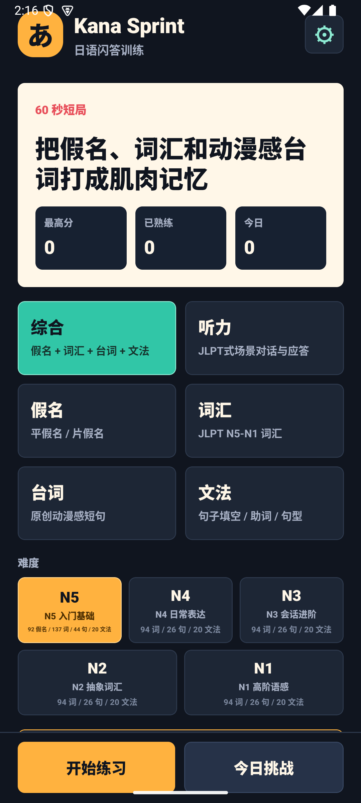

# Kana Sprint

一款使用 Expo 与 React Native 开发的 60 秒日语学习游戏。

玩家需要在限时挑战中完成假名、词汇、原创动漫风格台词、文法和 JLPT 听力题，通过连续答对积累分数，在短时间内反复练习日语识别与回忆能力。

<p align="center">
  
</p>

## 核心玩法

- 60 秒短局，答对可提高连击和分数，答错会损失生命。
- 支持综合、假名、词汇、台词、文法、听力六种模式。
- 覆盖 JLPT N5、N4、N3、N2、N1 五个难度等级。
- 听力模式采用十题生存制，并根据题目长度和等级调整作答时间。
- 普通练习会优先抽取未掌握和近期答错的内容。
- 同一局中答错的题目会在间隔两题后再次出现，帮助立即巩固。
- 每日挑战使用固定题序，方便重复挑战和比较成绩。
- 记录各模式、各等级的最高分、熟练度、薄弱项和每日进度。
- 无需注册账号，学习记录和设置均保存在本地。

## 主要功能

- 92 个假名、513 个词汇、148 条原创台词、100 道文法题和 250 个 JLPT 风格听力场景。
- 1,103 个本地日语语音文件，原生版本可离线播放。
- 听力场景使用不同声线区分旁白与对话角色。
- 支持简体中文、繁体中文、英语、法语、意大利语、德语、西班牙语、韩语、波兰语和巴西葡萄牙语。
- 默认跟随系统语言，也可在设置中手动切换。
- 内置 Rush、Focus、Night 三首背景音乐，默认关闭。
- 支持薄弱项复习、学习路线建议、每日目标和阶段成就。
- 支持前后台切换时暂停计时与自动发音。
- 预留激励广告续关入口；未配置正式 AdMob 信息时不会启用线上广告。

## 技术栈

- Expo SDK 56
- React Native 0.85
- React 19
- TypeScript
- AsyncStorage
- Expo Localization
- Expo Audio
- EAS Build / EAS Submit
- react-native-google-mobile-ads

## 环境要求

- Node.js 22.13 或更高版本
- npm
- 原生构建需要对应的 Android 或 iOS 开发环境
- 生成离线日语语音时需要本地运行 VOICEVOX

## 本地运行

安装依赖：

```powershell
npm install
```

启动 Expo：

```powershell
npm run start
```

也可以直接启动指定平台：

```powershell
npm run android
npm run ios
npm run web
```

## 常用验证命令

```powershell
# TypeScript 类型检查
npm run typecheck

# 游戏规则与题库契约检查
npm run gameplay-check

# 离线语音包检查
npm run pronunciation:check

# Expo 项目健康检查
npm run doctor

# 查看当前上线准备状态
npm run release:status

# 执行完整本地发布验证
npm run release:verify
```

准备提交商店前，使用以下严格检查：

```powershell
npm run release:store-ready
```

该命令会在公开网址、审核联系人、正式 AdMob 配置或人工确认项缺失时主动失败，避免误提交不完整版本。

## 离线日语语音

原生版本为全部学习内容打包本地语音，Web 版本使用系统日语语音作为轻量回退方案。

修改日语题目后，可重新生成并检查语音：

```powershell
npm run pronunciation:generate
npm run pronunciation:check
```

语音由 [VOICEVOX](https://voicevox.hiroshiba.jp/) 生成。项目实际使用三种声线；点击表格中的试听链接，可在 VOICEVOX 官方页面直接播放对应的声音样本：

| 用途 | VOICEVOX 声线 | Speaker ID | 官方试听 |
| --- | --- | ---: | --- |
| 普通学习内容与听力对话角色 A | 四国めたん／ノーマル | 2 | [试听四国めたん](https://voicevox.hiroshiba.jp/product/shikoku_metan/) |
| JLPT 听力题旁白与问题播报 | No.7／アナウンス | 30 | [试听 No.7](https://voicevox.hiroshiba.jp/product/number_seven/) |
| 听力对话角色 B | 玄野武宏／ノーマル | 11 | [试听玄野武宏](https://voicevox.hiroshiba.jp/product/kurono_takehiro/) |

项目中的完整署名为：

```text
VOICEVOX:四国めたん / No.7 / 玄野武宏
```

使用相关音频前，请同时确认 [VOICEVOX 软件使用条款](https://voicevox.hiroshiba.jp/term/) 和各声线官方页面所链接的音声库条款。

## 激励广告

游戏只在续关场景提供激励广告入口。正式广告默认关闭，只有在环境变量中提供完整、有效的 AdMob App ID 和激励广告单元 ID 后才会启用。

先复制环境变量模板：

```powershell
Copy-Item .env.example .env.local
```

配置说明请查看：

- [AdMob 配置说明](docs/admob-setup.md)
- [AdMob 上线交接](docs/admob-setup-handoff.md)
- [隐私问卷说明](docs/app-store-privacy-answers.md)

## 项目结构

```text
.
├─ App.tsx                    # 应用主界面与游戏流程
├─ src/                       # 题库、游戏逻辑、本地化、音频与广告边界
├─ assets/                    # 图标、背景音乐、离线语音和商店截图
├─ languages/                 # Expo 原生语言资源
├─ scripts/                   # 题库、隐私、截图和发布验证脚本
├─ site/                      # 支持、隐私和开源许可页面
├─ docs/                      # 发布审计、测试记录和上线交接文档
├─ app.json                   # Expo 应用配置
├─ app.config.js              # 环境变量与原生插件配置
└─ eas.json                   # EAS 构建和提交配置
```

## 构建与发布

项目已经配置 EAS，常用命令如下：

```powershell
# iOS 模拟器构建
npm run build:ios-simulator

# iOS 正式构建
npm run build:ios

# 提交到 App Store Connect
npm run submit:ios
```

当前核心游戏、十种界面语言、N5–N1 学习内容、离线语音、商店截图和发布审计均已具备。正式提交前仍需完成真实商店账号相关事项：

- 填写 App Store 审核联系人。
- 确认 App Store Connect 应用记录。
- 配置正式 AdMob ID 与隐私消息。
- 确认最终隐私问卷。
- 使用目标正式包完成真机或 TestFlight 测试。

详细状态与上线顺序：

- [当前项目状态](docs/CURRENT-STATUS.md)
- [最终上线流程](docs/final-launch-runbook.md)
- [生产设备测试清单](docs/production-device-smoke-test.md)
- [发布交接说明](docs/release-handoff.md)

## 数据与隐私

- 不要求注册或登录。
- 不提供用户内容上传。
- 学习记录和设置默认只保存在设备本地。
- iOS 隐私清单已包含在项目配置中。
- 未配置正式广告时，不启用线上 AdMob 广告。

## 许可证

项目使用 [MIT License](LICENSE)。
